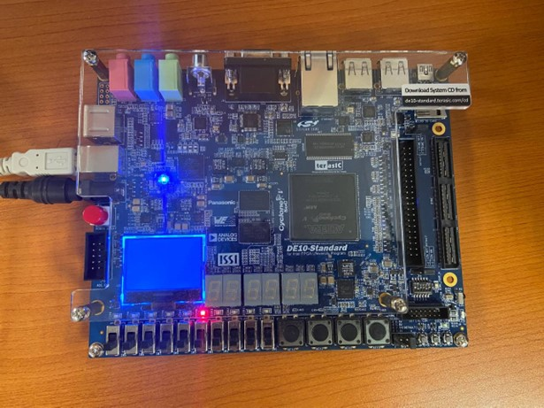

# Overview

This is my Final Year Project in Nanyang Technological University, Singapore. This project earns me an fair-and-square 'A' grade. Cheers!

The project aims to implement a hardware accelerator for a simplified LeNet-5 CNN to recognize MNIST digits.

Until now, the project has been completed. The hardware accelerator is implemented on a De-10 Standard Cyclone V SX SoC—5CSXFC6D6F31C6N FPGA.
 <!-- insert markdown image -->

The 4th LED light is on since the image is recognized as digit 4.

The inner structure of the accelerator is LeNet-5. 

For this project only, I've unrolled all the loops in the LeNet-5 structure. This will cause extreme high resource usage - if I have time in the future I would fold some structures and make it pipelined.

The verilog code has been synthesized and implemented on the Intel Altera FPGA. I can't promise that it will work on other FPGA platforms(Xilinx).